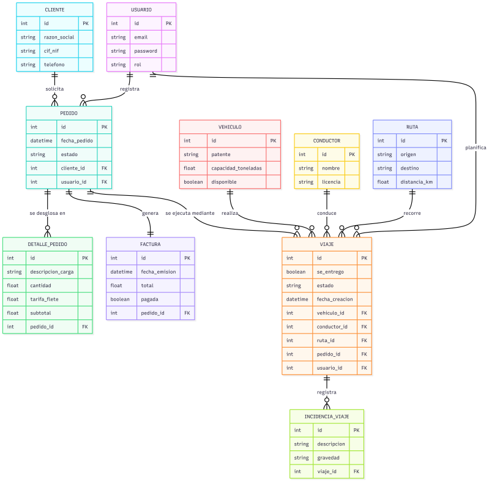

# 🚛 Proyecto TRANSPORTE API

Sistema backend para la gestión logística de transporte, administración de flota, seguimiento de operaciones y gestión de actores (clientes y conductores). Construido con **Flask**, **PostgreSQL** y **Docker**.

## 🚀 Tecnologías Principales
- **Backend:** Flask (Python)
- **Base de Datos:** PostgreSQL
- **Autenticación:** JWT (Flask-JWT-Extended)
- **Serialización:** Marshmallow
- **Contenedores:** Docker & Docker Compose
- **Testing:** Pytest

---

## 📂 Estructura del Proyecto

```text
transporte/
├── src/                    # Código fuente de la aplicación
│   ├── models/             # Modelos de SQLAlchemy (Base de datos)
│   ├── routes/             # Blueprints y controladores de la API
│   ├── services/           # Lógica de negocio
│   ├── schemas/            # Validación y serialización (Marshmallow)
│   ├── database/           # Configuración de la conexión a DB
│   ├── app.py              # Fábrica de la aplicación (App Factory)
│   └── config.py           # Configuración de variables de entorno
├── tests/                  # Pruebas automatizadas (Unitarias y de Integración)
├── migrations/             # Migraciones de base de datos (Alembic)
├── Dockerfile              # Configuración de construcción de imagen Docker
├── docker-compose.yml      # Orquestación de servicios (App, DB, pgAdmin)
├── requirements.txt        # Dependencias de Python
├── run.py                  # Punto de entrada para iniciar el servidor
├── seed.py                 # Script para poblar la base de datos con datos de prueba
└── README.md               # Documentación del proyecto
```

---

## 🛠️ Comandos de Inicio

### 1. Iniciar con Docker (Recomendado)
Para levantar todo el entorno (API, Base de Datos y Panel de Control):

```bash
# Construir las imágenes
sudo docker compose build

# Levantar los servicios en segundo plano
sudo docker compose up -d
```

### 2. Gestión de Base de Datos
Si necesitas aplicar cambios en el esquema de la base de datos o poblarla:

```bash
# Aplicar migraciones pendientes
sudo docker compose exec app flask db upgrade

# Ejecutar el script para sembrar (seed) datos iniciales
sudo docker compose exec app python seed.py
```

### 3. Ejecutar Pruebas (Pytest)
Para validar que todo funciona correctamente:

```bash
# Ejecutar todos los tests dentro del contenedor
sudo docker compose run --rm app pytest
```

### 4. Ver Logs y Depuración
Si la aplicación no arranca o quieres ver errores en tiempo real:

```bash
# Ver logs de la aplicación Flask
sudo docker compose logs -f app
```

---

## 🔐 Autenticación (JWT)
El proyecto usa **JSON Web Tokens** para la seguridad.
1. Haz un `POST` a `/api/auth/login` con tus credenciales.
2. Recibirás un `token`.
3. Incluye ese token en la cabecera de tus peticiones: `Authorization: Bearer <TU_TOKEN>`.

---

## 📊 Panel Visual de Base de Datos
Puedes acceder a **pgAdmin** para gestionar la base de datos visualmente en:
- **URL:** `http://localhost:5050`
- **Usuario:** `admin@admin.com`
- **Contraseña:** `admin`

---

## 🗄️ Esquema de Base de Datos (Modelo ER)

A continuación se muestra el diagrama Entidad-Relación que ilustra la arquitectura de la base de datos de la plataforma logística, abarcando clientes, pedidos, vehículos, conductores y rutas.


