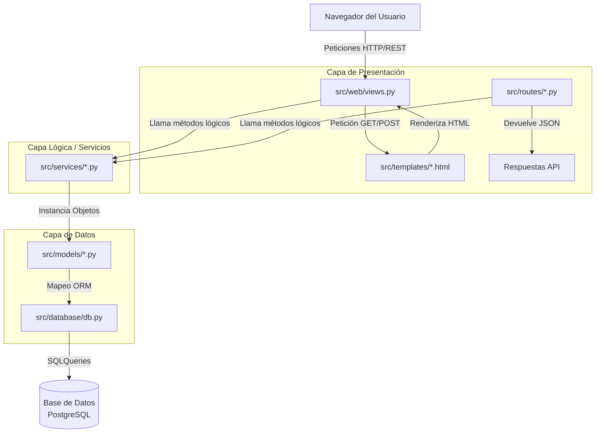

# Análisis Detallado: Estructura, CRUDs y Lógica del Proyecto Transporte

Este documento proporciona una investigación y evaluación exhaustiva de la arquitectura del proyecto, enfocándose en cómo se implementan las operaciones CRUD (Crear, Leer, Actualizar, Eliminar), la interacción entre los diferentes archivos, la lógica de negocio, la conexión con las vistas (Jinja) y la base de datos.

---

## 1. Mapa de Estructura y Flujo de Datos

El sistema está diseñado siguiendo el patrón de diseño **MVC (Modelo-Vista-Controlador)** complementado con el patrón de **Servicios**. Esto separa las responsabilidades, manteniendo el código limpio y mantenible.



---

## 2. Carpetas donde se Maneja la Lógica

La lógica principal no se mezcla en un solo lugar, sino que está segregada por su propósito en las siguientes carpetas dentro de `src/`:

- **`src/database/`**: Contiene `db.py`, que define la instancia central de `SQLAlchemy`. Aquí es donde "nace" la conexión a la base de datos.
- **`src/models/`**: Contiene la definición de tablas y relaciones (Ej: `actores.py`, `logistica_flota.py`). Esta es la representación de la base de datos en código Python.
- **`src/services/`**: **Aquí reside el corazón lógico de la aplicación**. Los archivos en esta carpeta se encargan de recibir información, procesarla, aplicar reglas de negocio y comunicarse con la base de datos a través de los Modelos. 
- **`src/routes/`**: Controladores pensados para funcionar como una API (comunicación JSON). Atrapan la petición, se la pasan a `services` y retornan una respuesta en formato JSON.
- **`src/schemas/`**: Se encarga de serializar (convertir de Objeto Python a JSON) y deserializar/validar la información de entrada.
- **`src/web/`**: Son los controladores de la aplicación tradicional orientada a usuario. Conectan la lógica de `services` con las plantillas de Jinja2.

---

## 3. Detalle de los CRUDs y Funciones Lógicas

Los CRUDs de este proyecto se encapsulan totalmente dentro de la capa de Servicios (`src/services`). Cada archivo es una clase estática (por ejemplo, `ActoresService`, `TransaccionService`) que actúa como "cajero" para solicitar, guardar o eliminar datos.

### A. Funciones Lógicas de Lectura (Read)
Se utilizan para extraer información.
- **`get_all_[entidad]()`**: Retorna todos los registros de una tabla utilizando la sintaxis de SQLAlchemy (`Entidad.query.all()`).
- **`get_[entidad]_by_id(id)`**: Busca un elemento concreto. Utiliza `db.session.get(Modelo, id)`.

### B. Funciones Lógicas de Creación (Create)
- **`create_[entidad](data)`**: 
  1. Recibe un diccionario `data` (con datos de un formulario web o un JSON).
  2. Desempaqueta y crea una nueva instancia del Modelo correspondiente: `Entidad(**data)`.
  3. Prepara la inserción: `db.session.add(entidad)`.
  4. Ejecuta el commit para guardarlo definitivamente: `db.session.commit()`.

### C. Funciones Lógicas de Actualización (Update)
- **`update_[entidad](entidad, data)`**: 
  1. Recibe el objeto ya buscado en la base de datos y un diccionario con los nuevos datos.
  2. Mediante un ciclo `for key, value in data.items(): setattr(entidad, key, value)`, actualiza dinámicamente cada campo que vino en el formulario.
  3. Guarda los cambios permanentemente con `db.session.commit()`.

### D. Funciones Lógicas de Eliminación (Delete)
- **`delete_[entidad](entidad)`**:
  1. Recibe el objeto de la base de datos.
  2. Lo marca para eliminación: `db.session.delete(entidad)`.
  3. Confirma el cambio: `db.session.commit()`.

### Ejemplo Práctico: Conexión Archivo a Archivo (Clientes)
1. El usuario envía un formulario en la ruta web (`src/web/views.py`).
2. El Blueprint de web importa y usa el servicio: `from src.services.actores_service import ActoresService`.
3. Llama a `ActoresService.create_cliente(data)`.
4. En `src/services/actores_service.py`, se importa la Base de Datos (`from src.database.db import db`) y el modelo (`from src.models.actores import Cliente`).
5. El servicio guarda la información interactuando con el motor ORM.

---

## 4. Conexión con Jinja (Motor de Plantillas)

**Jinja2** es el motor que permite insertar código Python dinámico dentro del código HTML estático. En esta aplicación, la magia de Jinja se conecta mediante la carpeta `src/web/`.

### ¿Cómo interactúan?
1. **El Controlador Web (`src/web/views.py`)**: Cuando el usuario entra a la ruta `/clientes`, el controlador solicita todos los clientes usando `ActoresService.get_all_clientes()`.
2. **Inyección de variables (`render_template`)**: La función inyecta los datos obtenidos al frontend enviando la variable:
   ```python
   # Envía la variable 'clientes' al HTML
   return render_template("clientes/list.html", clientes=clientes)
   ```
3. **Manejo Dinámico en Jinja**: En el archivo `list.html` (dentro de `src/templates`), Jinja captura esa variable y usa sus propias sentencias de control para renderizarla. Por ejemplo:
   ```html
   
      <tr>
         <td>{{ cliente.razon_social }}</td>
         <td>{{ cliente.cif_nif }}</td>
      </tr>
   
   ```
   *Nota: Las llaves `` ejecutan la lógica, y las `{{ }}` imprimen el valor de una variable.*

Además, la aplicación aprovecha Jinja para mandar mensajes emergentes o de error al usuario mediante el sistema de **Flash** de Flask, que luego Jinja recupera (`get_flashed_messages()`).

---

## 5. Información y Conexión con la Base de Datos

La aplicación está íntegramente conectada mediante un ORM (Object-Relational Mapping) llamado **SQLAlchemy** encapsulado por `Flask-SQLAlchemy`.

### El Núcleo: `src/database/db.py`
Todo el proyecto gira alrededor de una sola instancia instanciada en este archivo:
```python
db = SQLAlchemy()
```

### Los Modelos y las Tablas:
Cada archivo en la carpeta `src/models/` importa este objeto `db`. En vez de escribir sentencias SQL (como `SELECT * FROM clientes`), la aplicación crea clases de Python:
- Cada clase hereda de `db.Model` (ej. `class Vehiculo(db.Model):`).
- El atributo `__tablename__` vincula la clase con el nombre real de la tabla en PostgreSQL.
- Los atributos de clase se definen como `db.Column`, indicando el tipo de dato (Entero, String, Booleano, etc.) y las restricciones (nulos, únicos).

### Relaciones entre Entidades:
El proyecto maneja las Foreign Keys mediante `db.ForeignKey` y crea puentes virtuales con `db.relationship()`.
Por ejemplo, en el caso de **Viajes** (`src/models/logistica_flota.py`):
```python
# Crea la llave foránea real hacia la tabla de vehículos
vehiculo_id = db.Column(db.Integer, db.ForeignKey('vehiculos.id'))

# Crea el puente virtual que permite hacer viaje.vehiculo.patente
vehiculo = db.relationship('Vehiculo', backref=db.backref('viajes'))
```
Esto permite que, una vez obtenida la información del Viaje en Jinja, se pueda acceder inmediatamente a todos los datos del camión (patente, tipo, etc.) sin hacer una nueva búsqueda explícita, porque SQLAlchemy lo resuelve internamente de forma mágica y transparente.
